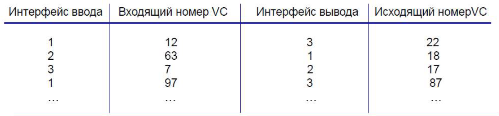

## Периферия сети. Конечные системы. Сети доступа. Кабельная сеть доступа.
- Конечная система = хост (компьютеры, серверы, ...)
- Сеть доступа = сеть, которая физически соединяет конечную систему с первым маршрутизатором (домашние сети доступа, корпоративные, ...)
- DSL (Digital Subscriber Line) -- использование существующей телефонной линии до мультиплексора центрального офиса. В центральном офисе есть соответствующий мультиплексор, который перенаправляет данные в сеть, а голос в телефонную линию.
    - входящая скорость передачи < 2,5 Мбит/c (обычно < 1 Мбит/c)
    - исходящая скорость передачи < 24 Мбит/c (обычно < 10 Мбит/c)

- Кабельная сеть доступа
    - мультиплексирование по частоте: разные каналы передаются по разным полосам частот
    - пакеты от головных станций идут по нисходящему каналу во все дома
    - пакет, исходящий из дома, по восходящему каналу идет в головную станцию
    - HFC: гибридная оптико-коаксиальная сеть: асимметричная: входящая скорость передачи до 30 Мбит/c, исходящая 2 Мбит/c
    - Сеть из оптоволокна и коаксиального кабеля соединяет дома с провайдером:
        - дома делят доступ к головной кабельной станции, в отличие от DSL

## Физические носители. Витая пара, коаксиал, оптоволокно. Радиоканалы.
- медная витая пара
    - несколько пар изолированных медных проводников. В каждой паре они скручены вместе. В паре передается один и тот же сигнал, но в одном +, а в другом -, приёмник восстанавливает сигнал как разность сигналов в паре. Это добавляет устойчивость к внешним помехам.
    - неэкранированная витая пара: отсутствие дополнительных экранов из фольги или металлической оплетки. Проще установка, дешевле, все равно остаточно надежно. Чаще используется.
- коаксиальный кабель
    - два концентрических медных проводника (данные передаются по внутреннему)
    - двунаправленное соединение
    - широкополосный доступ: мультиканальная передача данных HFC
- оптоволоконный кабель
    - передает световые импульсы, из-за этого не чувствителен к ЭМ помехам, большая производмительность, меньше ошибок
- радиоканалы
    - передача сигнала ЭМ волнами радиодиапазона
    - минусы: отражение, интерференция, затухание сигнала, поглощение препятствиями
    - двунаправленная передача, дешево
    - виды:
        - наземные: LAN(wi-fi), глобальные(3g,4g,5g)
        - спутниковые геостационарные станции (далеко, сигнал идет долго), низкоорбитальные (ближе к Земле, но нужно частое переподключение)

## Ядро сети. Основные функции. Задержка передачи. Передача с промежуточным накоплением.
- Ядро сети -- набор коммутаторов пакетов и каналов связи, кот. взаимодействуют с хостами.
    - его свойства:
    1. маршрутизация (алгоритм маршрутизации) (составление таблички)
    2. перенаправление -- передача пакетов со входов на соответствующий выход (руководствуясь табличкой)
- Коммутация пакетов -- когда сообщение прикладного уровня делится хостом на пакеты
- Задержка передачи пакета: L/R, где L бит -- размер пакета, R бит/с -- скорость передачи. = пропускная способность = емкость
- Передача с промежуточным накоплением: передача дальше в сеть происходит только после приема вмего пакета. То есть если маршрутизаторов ("передатчиков") на пути пакета k, то задержка k*L/R.

## Коммутация пакетов. Коммутация каналов. Мультиплексирование с разделением по частоте и по времени.

- Коммутация каналов: выделенные ресурсы на линии от источника до приемника резервируются для вызова.
    - гарантируется постоянная скорость и минимальная задержка
    - участок канала простаивает, если через него не проходит вызов
    - телефонные сети
    - возможно мильтиплексирование:
        1.  FDM -- с разделением по частоте (как в радио)
        2.  TDM -- с разделением по времени
- Коммутация пакетов
    - данные разбиваются на пакеты
    - пакеты погут двигаться по разным маршрутам
    - эффективнее, можетпредоставить доступ к сети большему числу пользователей
- Мультиплексирование:
    - по частоте (требует более сложного оборудования) 
    - по времени
    - гибридное

## Интернет как сеть сетей. Уровни провайдеров.
- за $O(n^2)$ все сети доступа соединять слишком затратно
- несколько уровней провайдеров
    1. Провайдеры верхнего уровня (12) -- вершина иерархии. Соединены между собой, также имеют Internet Exchange Points -- точки обмена трафиком.
    2. Региональные интернет-провайдеры -- связывают сети доступа с провайдерами 1 уровня.
    3. Сети доступа
Также провайдеры контента Google, Microsoft создают собственные сети,  добавляясь на 1 уровень. Чтобы быть ближе к пользователям.

## Задержки при пакетной коммутации. Задержка обработки, ожидания, передачи и распространения.
- скорость поступления пакетов больше, чем скорость отправки
- пакеты ожидают в очереди маршрутизаторов
- 4 типа задержек в узле сети:
    1. обработки -- контроль ошибок, определение исходящей линии для посылки пакета
    2. ожидания -- когда пакет находится в очереди
    3. передачи -- время на проталкивание всех битов пакета в линию. L/R, где L -- размер пакета, R -- полоса пропускания линии (бит/с)
    4. распространения пакета в линии связи. d/s, где d -- длина канала, s -- скорость распространения
- пусть a -- средняя скорость поступления пакетов. La бит в секунду в среднем поступает в очередь. При La/R -> 1 задержка ожидания стремится к oo.
- traceroute -- программа для подсчёта таких задержек.
## Потеря пакетов. Пропускная способность.
- Пропускная способность сети -- количество данных, которое сеть способна передать за секунду. Может быть мгновенной и средней.
- если очередь маршрутизатора заполнена, новые пакеты отбрасываются. В теории он может быть переотправлен предыдущим узлом или исходной конечной системой, откуда он идет.
- пропускная способность последовательного соединения линий с максимальными скоростями передачи R_1, ..., R_n равна $min(R_1, ..., R_n)$.

## Стек протоколов Интернета. Эталонная модель ISO/OSI.
Нужно как-то организовать сетевую архитектуру.
1) Прикладной -- для поддержки сетевых приложений. FTP, SMTP, HTTP. *пакет*
2) Транспортный -- на уровне ОС -- передача данных между приложениями. Логическое соединение между процессами приложений. TCP, UDP *сегмент*
3) Сетевой -- передача дейтаграмм от источника к приёмнику IP, протоколы маршрутизации. *дейтаграмма*
4) Канальный -- передача данных между соседними узлами сети (Ethernet, 802.11(wifi), PPP) *кадр*
5) Физический: биты в среде передачи

В эталонной модели ISO/OSI между прикладным и транспортным также есть
- представительский -- чтобы приложениям верно интерпретировать данные в разл. форматах (шифрование, сжатие)
- сеансовый -- средства для контроля сеансом и его восстановление в случае разрыва соединения.

Но эти задачи могут быть решены на прикладном уровне разработчиком приложения.

Основные ресурсы на упаковку/распаковку пакетов -- хосты, конечные системы.

## Сетевая безопасность. Вирус, червь, программы-шпионы, DDoS-атака. Сниффинг. IP спуффинг (подмена адреса).
Безопасность не была частью замысла создателей Интернета.
- Вирус: саморазмножающееся ПО, заражает устройство после получения/запуска объекта (например, из письма по электронной почте)
- Червь: саморазмножающееся ПО, заражает устройство после получения объекта, запускается без участия пользователя.
- Программы шпионы: анализ нажатий клавиш, посещенных веб-сайтов
- DDoS -- Distributed Denial of Service -- перегрузка серверов приложения (или тп) искусственным трафиком, исходящим от откружающих хостов. Делает приложение недоступным для пользователя.
    
    В приложении, часто, на каждый запрос может создаваться по потоку, при перегрузке клиентами это F.

- IP-спуффинг
    В широковещательной сети (wifi в кафе) левые устройства могут заниматься *сниффингом* -- читать все проходящие пакеты (как Wireshark). *библиотека pcap в C++*

    На основе удачно перехваченной информации, злоумышленники могут начать отправлять в сеть пакеты с ложным IP-адресом источника.

## История Интернета.
+ 1961-1972 -- зарождение основ
    - 1961 (Клейнрок) -- эффективность теории очередей
    - 1964 (Бэран) -- сети с коммутацией пакетов министерства обороны США.
    - ARPANet (Advanced Research Project Agency)
        - 1969 -- заработал первый узел сети
        - 1972 -- публичная демонстрация (Роберт Кан)
            - NCP (Network Control Protocol)
            - первая эл. почта
            - 15 узлов

+ 1972-1980 -- развитие частных сетей и Интернета
    - сеть ALOHA на Гавайах, ПД по спутниковой связи
    - 1974 (Кан, Серф) -- архитектура, объединяющая сети. Появление термина Интернет.
    - 1974 -- Ethernet в Xerox PARC
    - др. компании
    - 1979 -- 200 узлов в ARPANet
    - появление TCP, UDP, IP протоколов для сетевого взаимодействия.

    - принципы сетевого взаимодействия Серфа и Кана:
        1. минимализм: не надо менять внутреннюю архитектуру
        2. децентрализованное управление
        3. маршрутизаторы не сохраняют состояние
        4. качество обслуживания

+ 1980-1990 -- новые протоколы, распространение сетей
    - 1983 -- внедрение TCP/IP
    - 1982 -- протокол SMTP для электронной почты
    - 1983 -- протокол DNS для трансляции имён в адреса
    - 1985 -- протокол FTP
    - 1988 -- механизм контроля данных в TCP
    - ~1985 -- появление новых сетей. Minitel (Франция)

+ 1990-2000
    - конец ARPANet
    - World Wide Web
    - HyperText (Буш 1945)
    - HTML, HTTP (Тим Бернерс-Ли)
    - коммерциализация сети
    - новые разработки, файлообменные одноранговые сети, появление сетевой безопасности, 10^8 пользователей, появление скоростей в Гбит/с.

+ н.в.
    - миллиарды хостов, мобильная революция
    - развитие скоростей беспроводных сетей
    - развитие широкополосного доступа, в т.ч. быстрого беспроводного
    - соцсети
    - провайдеры контента (Google,  Microsoft) создают свои сети
    - электронная коммерция
    - новые проблемы -- безопасность/приватность, цензура

## Прикладной уровень. Протоколы. Клиент-серверная и одноранговая (P2P) архитектуры.
Уровень поддержки сетевых приложений, работает поверх транспортного. На хостах работает ПО приложения, ему надо обмениваться пакетами. Приложение умеет формировать и раскодировать свои пакеты по своим личным правилам. Для передачи они транслируются на транспортный уровень и дальше приложению уже не сильно важно, как путешествуют данные.

Наиболее популярные протоколы:
- FTP
- SMTP / POP3 / IMAP
- DNS
- HTTP

Типы архитектуры:
- Клиент-серверная. Сервер -- постоянно запущенный хост, всегда находится онлайн и обрабатывает запросы от клиентов. Имеет постоянный IP-адрес. WWW, FTP, электронная почта.
- Одноранговые (P2P) Bit-torrent, IP-телефония
- Гибридные (мессенджеры: серверы нужны для отслеживания IP-адресов пользователей, а сообщения отправляются напрямую)

## Сокеты. Адресация процессов.
Сокет -- программный интерфейс для отправки/получения сообщений (пакетов). "Дверь" между прикладным и транспортным уровнем. API между приложением и сетью. Приложение находится по прикладную сторону, и с транспортной стороны может регулировать только транспортный протокол и его базовые настройки (типа размера окна).

У хоста всегда есть свой 32-битный IP-адрес, но для адресации процессов этого недостаточно, так как процессов скорее всего много. Для идентификации процесса также необходим порт.
- порт HTTP-сервера: 80
- порт почтового сервера: 25

## Всемирная паутина и HTTP. Постоянное и непостоянное HTTP-соединение.
Терминология WWW:
- веб-страница состоит из объектов -- текст, картинки, аудио и тп
- она включает HTML-файл, который ссылается на все остальные дочерние объекты
- у каждого оюъекта -- свой URL-адрес

Протокол HTTP (HyperText Transfer Protocol)
- на прикладном уровне для веб-приложений, работает поверх TCP.
- клиент запрашивает веб-объекты, сервер их возвращает.
- stateless протокол (не сохраняет состояние): сервер не хранит информацию о последних запросах.

HTTP соединение может быть:
- Постоянное: через одно соединение можно отправить много объектов
- Непостоянное: через одно соединение можно отправить только один объект и получить ответ (результат отправки)

Round Time Trip (RTT) время, необходимое небольшому пакету на то, чтобы сгонять от клиента до сервера и обратно.

Для непостоянного соединения надо два RTT (первый -- на инициализацию TCP-соединения) + время на передачу файла.

В постоянном на каждый объект нужно по одному RTT. Ну и один инициализирующий TCP-соединение RTT, но это мелочь.

## HTTP-сообщения: запрос, ответ. Форматы HTTP-сообщений.
Кодируются в ASCII.
### Запрос
- Команда/метод: GET (запрос каких-то объектов), POST (когда ввели какие-то данные, в форме, например. Сами данные передаются в теле), HEAD (рофельный, чисто для отладки, тело сообщения пустое), ...
- URL
- строки заголовка в формате: имя поля заголовка + значение (язык, версия HTTP, используемый браузер, допускаемые кодировки, connection: keep-alive, форматы принимаемых файлов)
- тело сообщения (опционально, уже зависит от приложения)

HTTP/1.1 отличается от HTTP/1.0 добавлением новых методов (PUT,  DELETE -- аналогия с запросами в бд)

## Основные методы HTTP. Коды состояния HTTP-ответа.
### Ответ
- код состояния протокола и сообщение состояния (200 OK, 400 Bad Request, 301 Moved Permanently, 404 Not found, 505 HTTP Version Not Supported)
- строки заголовка: дата, last modified, content length, content type
- данные

## Объекты cookie («Куки»).
Механизм cookie позволяет вебсайтам отслеживать состояние пользовательского соединения. Он состоит из 4 компонентов:
1. строка заголовка в HTTP-запросе
2. строка заголовка в HTTP-ответе
3. база данных на сервере
4. cookie-файл на стороне пользователя

С помощью куки сайты начинают предлагать "подходящую" рекламу и тп.

## Веб-кэш (прокси-сервер). Условный GET-запрос.
Кэш может устанавливаться интернет-провайдером. Также может быть в браузере. Нужен для уменьшения времени отклика и нагрузки на сервер и на сеть. *локальный прокси-сервер*.

Если у от клиента исходит GET-запрос по какой-то URL, веб сервер, если видит ответ на такой же запрос с датой data, то перенаправляет уловный GET-запрос (с полем в заголовке if-modified-since),и если сервер отвечает 304 Not Modified, то файл заново передавать смысла нет.

## FTP. Принцип работы. Команды и ответы.
FTP используется для передачи файлов на удалённый хост(сервер) и с него.
- FTP-клиент обращается к FTP-серверу по порту 21 по TCP.
На 21 порте -- управляющее соединение -- аутенфикация, запросы на скачивание/сохранения файла, ответы сервера.
- Файлы передаются по отдельному соединению по 20 порту (соединение открывается перед отправкой/получением данных, и закрывается сразу после сервером)
- Говорят, что управляюшее соединение *вне полосы*.
- Команды:
    - USER username
    - PASS password -- аутенфикация
    - LIST -- узнать список файлов в текущем каталоге
    - RETR filename -- запрос на получение файла
    - STOR -- сохранение файла
- Ответы
    - 331 Username OK, password required
    - 125 Data connection already open
    - 425 Can't open data connection
    - 452 Error writing file

## Электронная почта. SMTP.
Электронная почта состоит из трех компонент
1) Агенты пользователя -- приложения (Gmail, Outlook, ...) которые как клиенты обращаются к почтовым серверам. Каждому клиенту соответствует свой почтовый сервер
2) Почтовые сервера
3) SMTP -- протокол взаимодействия этих серверов

SMTP имеет две стороны: клиентскую (исполняется на сервере клиента) и серверную (исполняется на сервере получателя).

Происходит всё в таком порядке.
1. Алиса пишет сообщение на почту Бобу bob@gmail.com. 
2. Её агент отправляет это письмо на Алисин сервер, там оно попадает в очередь
3. Клиентская часть SMTP открывает TCP-соединение с сервером Боба.
4. Через это соединение отправляется письмо.
5. Сервер Боба кладет полученное письмо в ящик Боба.
6. Боб, когда запускает своего агента пользователя, обращается к своему почтовому серверу и тот отсылает ему письмо. 
Нюансы:
- SMTP использует порт 25 для TCP-соединения.
- если от клиента к серверу передается несколько сообщений, они идут в рамках 1 TCP-соединения.
- 7-битный ASCII-формат сообщений.
- все объекты в одном сообщении, а не как в HTTP, где у каждого объекта своё.
- такой протокол называют push-протоколом: источник сам отправляет данные приёмнику. HTTP, например -- pull-протокол -- там это происходит по запросу приемника
- метка окончания ввода сообщения: CRLF.CRLF (начала ввода -- после команды DATA)
- тоже свои запросы-команды (HELO, MAIL FR, RCPT TO, DATA, QUIT), свои коды-ответы
- формат почтового сообщения
    + заголовок (To, From, Subject), здесь To и From могут быть любой абракадаброй. Реальные отправитель и получатель идут с командами MAIL FR и RCPT TO.
    + тело сообщения

## Протоколы доступа к почте. POP3, IMAP, HTTP.
Протоколы, через которые агент пользователя может взаимодействовать со своим почтовым ящиком.

- POP (POP3) (Post Office Protocol) -- авторизация, загрузка
    - авторизация: команды клиента USER и PASS, ответы сервера OK/ERR
    - транзакция:
        - LIST -- список сообщений
        - RETR n -- загрузка сообщения по номеру
        - DELE n -- удаление (у себя локально)
        - QUIT
    - можно загрузить-и-удалить (нельзя заново прочитать сообщение с другого устройства, если удалили), можно загрузить-и-сохранить (у себя локально)
    - не сохраняет состояние сеанса
- IMAP 
    - все сообщения хранятся в 1 месте -- на сервере
    - можно хранить их в каталогах
    - сохраняет состояние сеанса
    - можно запрашивать часть сообщение (напр., заголовок)
- HTTP
    - используется начиная с Hotmail'а в 1990

## DNS: службы, структура. Серверы верхнего уровня, авторитетные и локальные сервера.
DNS -- Domain Name System: хотим соответствие между доменом и адресом. Нужна *распределенная база данных*.

DNS-протокол для решения этой проблемы: хосты спраштивают у DNS-серверов, куда идти.
- работает поверх UDP, порт 53
- функция ядра сети, реализованная на прикладном уровне
Центролизовать было бы нелогично, так как такая база данных будет удалена от многих пользователей, через нее будет идти большой трафик

Существует архитектура из 3 слоев DNS-серверов, а также независимо от неё каждым провайдером предоставляется локальный DNS-сервер.

DNS-запрос от хоста путешествует так:
1) Если интересуемая URL есть в кэше локального DNS-сервера, IP берется из него. Если нет:
2) Локальный DNS-сервер отправляет запрос в корневой DNS-сервер. Получает в качестве ответа либо IP, либо DNS-сервер верхнего уровня, куда надо пойти:
3) Локальный DNS-сервер отправляет запрос в DNS-сервер верхнего уровняы. В качестве ответа получает либо IP, либо авторитетный веб-сервер, куда надо пойти:
4) Локальный DNS-сервер отправляет запрос в авторитетный DNS-сервер. От авторитетного DNS-сервера получает либо IP, либо вердикт,  что ссылка не та.

Всего до 8 DNS-сообщений.

Корневых DNS-серверов 13 в мире. 

Сервера верхнего уровня соответствуют доменам стран .ru, .nz, .uk, ... 

Авторитетные -- сервера отдельных организаций, предоставляющие инфу о соответствии имя -> IP.

Путешествие DNS-запроса рекурсивно-итеративно. Полностью рекурсивный подход не используется на практике. Т.к. будет большая нагрузка на верзние уровни иерархии.

Запись из кэша локального DNS-сервера сбрасывается, если проходит время TTL. Обычно в нём еще есть данные о серверах верхнего уровня, поэтому к корневым молжно не обращаться.

## Формат сообщения DNS. Атаки на DNS.
Типы записей в базе данных DNS (каждая запись -- четверка [имя, значение, тип, TTL]):
- A: имя хоста, IP-адрес
- NS: имя домена, значение авторитетного DNS-сервера (чтобы перенаправлять DNS-запросы дальше по цепочке) -- например, имя мб foo.com
- CNAME: имя - всевдоним, значение -- каноническое имя (www.ibm.com – на самом деле имеет имя servereast.backup2.ibm.com)
- MX: значение -- каноническое имя почтового сервера для псевдонима в поле имя. (т.о. можно использовать одинаковые псевдонимы для почтовых и веб- серверов)

Формат сообщения (одинаковый и запроса и ответа)
- заголовок
    - идентификатор 2 байта (одинаковый у соотв. запроса и ответа)
    - флаги 2 байта
        - 0 -- запрос, 1 - ответ
        - это авторитетный ответ
        - нужна ли рекурсия
        - рекурсия возможно (в ответе)
    - еще по 2 байта, чтобы записать длину каждой из 4 секций тела
- тело
    - вопросы (поля имени и типа)
    - ответы 
    - авторитетный источник (записи ответных серверов)
    - доп. инфа

## Одноранговая раздача файлов: BitTorrent.
- Нет сервера. Узлы подключаются периодически и могут менять адреса.
- Используется в обмене файлами BitTorrent, потоковом видео, Skype.
-  $D_{P2P} \ge max(F/u_s, F/d_{min}, NF/(u_s + \sum{u_i}))$
    Тут $d_{...}$ -- скорость загрузки файла, а $u_{...}$ -- выгрузки.
Оказывается намнорго быстрее, когда одинаковый файл надо отправить от сервера в $N$ клиентов: втупую это не быстрее чем за $N F / u_s$.

Принципы:

Пусть вот они обмениваются сегментами какого-то файла.

1) Запрос сегментов: Алиса запрашивает *сначала редкие*. За счет этого редкие сегменты раздаются быстрее и количество всех сегментов уравнивается.
2) *ты-мне-я-тебе* Алиса скидывает сегменты только топ-4 пирам, которые скидывают ей. Эти топ-4 пересматриваются каждые 10 секунд
3) *оптимистическая разблокировка узла* Каждые 30 секунд рандомно выбирается новый узел и ему начинают слать сегменты. (Этот узел присоединяется к топ-4 для каждого из узлов.)

## Распределенная хеш-таблица. Циркулярная хеш-таблица. Отток пиров.
Пусть у нас снова одноранговая сеть.

Распределенная хеш-таблица (DHT, Distributed Hash-Table).
Содержит пары (ключ - файл, значение IP-адрес хоста)
Узлы добавляют такие пары в таблицу. Точнее, ключ - хеш-функция от файла, значение -- идентификационный номер хоста.

Ключи и узлы -- числа "одного диапазона". И замутим так, что каждому ключу сопоставляется узел, с ближайшим номером, который больше.

Отсортируем пиры по возрастанию, в каждом будем хранить указатель на следующий, из послежнего в первый. Тогда чтобы по ключу дойти до нужного пира, в худшем случае надо пройти их всех, а в среднем -- половину от их количества.

Можно замутить бинпоисковую идею: из каждого будет выходить по $O(logN)$ ребер, и поиск будет за $O(logN)$.

Ещё надо обработать отток пиров: из каждого по два указателя на соседа и соседа соседа вперёд и так же назад.

BitTorrent использует *Kademlia DHT* для создания распределённого трекера.

## Транспортный уровень. Мультиплексирование и демультиплексирование. Демультиплексирование с установлением и без установления логического соединения.
Транспортный уровень -- логическое соединение между процессами приложений. Действует на хостах. На хосте отправителя -- делит сообщения с прикладного уровня на *сегменты*, передает на сетевой уровень. На хосте получателя -- получает IP-дейтаграммы с сетевого уровня, переводит их в сегменты, из сегментов собирает пакеты, которые дает прикладному уровню.

Мультиплексирование -- то, что транспортный уровень делает на хосте отправителя. Разбивает пакет на сегменты, у которых указывает в заголовке порты и IP.

Демультиплексирование -- то, что транспортный уровень делает на хосте получателя. Получает IP-дейтакграмму, преобразует в сегмент, и руководсьвуясь его заголоваком, отправляет на нужный сокет.

- Сокет -- программный интерфейс для передачи пакетов с прикладного уровня на транспортный и обратно.

Демультиплексирование без установления логического соединения -- UDP. Получив сегмент, транспортный уровень смотрит только на порт. Т.о. UDP-сегменты от разных отправителей отправляются всё равно в один и тот же сокет.

Демультиплексирование с установлением логического соединения -- TCP. Получив сегмент, уровень ищет сокет, соответствующий сокетной паре (четверка сокетов). Таким образом, но хосте получателя наа 1 порту мб несколько одновременных соединений.

## Протокол UDP. Заголовок сегмента. Контрольная сумма.
Используется для потоковых медийных сообщений, DNS.

Заголовок UDP-сегмента (8 байт):
- порт отправителя
- порт получателя
- длина данных в байтах
- контрольная сумма

Контрольная сумма считается так: сегмент делится на 16-битные числа, из складывают. Если она получается $\ge 2^{16}$, эту штуку $>>16$ и прибавляют к $ \&((1<<16)-1)$. Потом все биты инвертируют. Проверка на стороне получателя -- также посчитать сумму.

## Надежная передача данных. Протокол rdt2.*: канал с ошибками бит.
- rdt -- reliable data transfer
- прослойка между прикладным и транспортным уровнем, которая мб реализована на транспортном.
- делает канал надёжным от потерь пакетов и их порчи.
- rdt_send() --> ...-> udt_send()-> ... -> rdt_recv()-> ... -> deliver_data()
1. rdt1.0: подразумевается что дефолтный канал и так норм. DFA, соответствующие отправителю и получателю, имеют по 1 состоянию

2. rdt2.0: получатель -- DFA c 1 состоянием. Всегда получает пакет, и отсылает ACK или NAK отправителю. Отправитель -- DFA на двух состояниях: 1) ожидание отправки пакета 2) ожидание ACK или NAK.

    Такая схема уже лучше, но не учитывает, если ACK/NAK побьются на обратном пути

3. rdt2.1: удваивание количества состояний, потому что теперь к пакету/к ACK/NAK приписываем 0 или 1.

4. rdt2.2: вместо NAK можно слать ACK на последний хороший полученный пакет.

## Протокол rdt3.0: передача данных по каналу с возможными ошибками и потерями. Конвейеризация.
Добавим возможность потери пакетов.
Вне зависимости патери пакета/квитанции/чей-то задержки отправитель повторно пересылает пакет.

Добавляется таймер. DFA для отправителя меняется, для получателя -- нет.

Также имеет смысл теперь в сквозной нумерации пакетов и квитанций. Потому что при огромной задержке ACK1 может, когда таки придёт к отправителю, вызвать ложное срабатывание (отправитель подумает, что это ACK на кого-то другого).

Производительность протокола rdt3.0 низкая!
Задержка передачи мб 8мкс, а RTT 30мс, тогда его КПД 0.00027

Конвейеризация: когда отправитель посылает по нескольку пакетов, не дожидаясь подтверждений. Базовый проктоколы с конвейеризацией: Go-back-N и Selective Repeat.

## Протокол Go-Back-N.
- Отправитель может одновременно передавать до N неподтвержденных пакетов.
- Ответы получателя имеют вид ACK(n) -- до меня дошли все пакеты до n включительно.
- У отправителя есть таймер на наиболее ранний неподтвержденный пакет
1) Отправитель:
- k-разрядная нумерайия пакетов
- при отработке таймера все окно пересылается
- при получении ACK(n), если он не дублирующийся, окно двигается на 1
2) Получатель:
- всегда в ответ на пакет отправляет ACK(n)
- нет буферизации, а значит если пришел слишком старший пакет раньше времени, он отбрасывается. expectedseqnum -- номер ожидаемого пакета.

## Протокол Selected Repeat (SR) – выборочное повторение.
- Отправитель может одновременно передавать до N неподтвержденных пакетов.
1) Отправитель:
- когда получает ACK(n), отмечает, что n-ый пакет дошел успешно. Сдвигает окно, если это был первый пакет в окне.
- когда по какому-то пакеты получает timeout, пересылает его
2) Получатель: если получил пакет из его окна, и теперь этот пакет у него есть (либо этот пакет уже у него был) отсылает ACK(n). Если получает пакет с номером до окна: если не дальше чем N, то отсылает ACK(n), иначе игнорирует.

Если размер окна $N$, а номеров пакетов всего $k$, и $2 N > k$, может случиться проблема не соответствия окон. Когда отправитель послал, а получатель приняли пакет с одинаковым номером, но при этом это разные пакеты!

## Протокол TCP. Структура TCP-сегмента. Порядковые номера, ACK-пакеты.
- TCP-соединение состоит из буферов, переменных и сокета соединения на одном хосте, и тем же самым на другом хосте.
- MSS - maximum segment size
- Двунаправленный поток данных
- управляемый поток (нет переполнения у получателя)
- заголовок TCP-сегмента
    - порты получателя и отправителя (по 16 бит)
    - порядковый номер, номер подтверждения (по 32 бит, вычисляется по передаваемым байтам, то есть номер первого байта данных, который тут передается)
    - длина заголовка, флаги (URG -- срочные данные (обычно не исп.), ACK (поддерживает порядковый номер), PSH -- передать данные сейчас (обычно не исп.), RST, SYN, FIN -- для установления соединения.) (16 бит)
    - окно получателя -- номер байтов, которые получатель готов получить (16 бит)
    - контрольная сумма, как в UDP (16 бит)
    - указатель URG (16 бит)
    - дополнения (? бит)

    Итого обычно это 20 байт. А у UDP в заголовке 8.
- тело (данные) (? бит)    

В ACK-пакете -- номер ожидаемого следующего байта.

- вложенные кситанции -- когда ACK идёт с данными:

- обработка полученных не по порядку сегментов зависит от реализации

## Протокол TCP: время оборота, таймаут. FSM-схема TCP-отправителя.

RTT не должен быть слишком коротким или длинным.

- SampleRTT -- измерение с момента передачи сегмента до получения ACK-пакета. Игнорирует повторные передачи.

    Он меняется. Хотим, чтобы RTT менялся сглаженней.

- EstimatedRTT:

$ EstimatedRTT = (1 - \alpha) \cdot EstimatedRTT + \alpha \cdot SampleRTT$, $\alpha= 1/8 $.

- DevRTT: резерв. Чем сильнее RTT меняется, тем он больше.

$ DevRTT = (1- \beta) \cdot DevRTT + \beta \cdot (SampleRTT - EstimatedRTT) $ 

- timeout: $EstimatedRTT + 4 \cdot DevRTT$.

У отправителя только один таймер. Он для самого раннего неподтверждённого сегмента.

FSM-схема:
- пришли данные от приложения:
    - создать сегмент с порядковым номером, равным номером первого отправляемого байта данных в этом сегменте
    - если попадает в окно -- отправить
    - запустить таймер, если не запущен
- таймаут:
    - повторно передать первый сегмент, вызвавший таймаут, перезапустить таймер
- получено подтверждение
    - обновить свою инфу о подтвержденных сегментах (это сегменты со всеми байтами до плорядкового номера ACK)
    - перезапустить таймер, если есть неподтвержденные сегменты

## Протокол TCP: повторная передача. Удвоение интервала ожидания. Ускоренная повторная передача.

При каждой повторной передаче TCP удвает значение интервала. Но если таймер запускается после того, как пришел ACK, либо от новых данных приложения, timeout считается по формуле выше.

Ускоренная повторная передача: когда повторно шлем пакет, хотя таймаут еще не случился.

Поведение получателя:

- пришел верный сегмент, да него все номера подтверждены. Ждем 500 мс до след сегмента, если тот не приходит, оптравляется ACK-пакет
- пришел верный сегмент, до него один не подтвержден и ждет. Отправляется общий ACK-пакет
- пришел неверный сегмент (номер больше ожидаемого). Незамедлительно отправляется ack.
- пришел сегмент, соответствующий нижнему месту в разрыве -- незамедлительно шлется ACK-пакет.

Если отправитель получил 3 ACK-пакета на одни данные (*утроенный ACK-пакет*), он пересылает их.

## Протокол TCP: управление потоком. Окно приема rwnd.
Получатель объявляет отправителю свой размер буфера RcvBuffer, включая значение rwnd -- свободное пространство буфера, куда складываются сегменты.

Отправитель не посылает количество сегментов больше, чем влезет. Гарантия непереполнения.

## Протокол TCP: трех-шаговое рукопожатие. Закрытие соединения.

Проблемы 2-шагового рукопожатия:
1) Если synack на первый запрос клиента задерживается, клиент повторно отправляет syn-запрос на соединение. Если он дойдёт слишком поздно, после общение клиента с сервером, то он запустит новое неожиданное соединение.
2) Повторный syn, и повторная посылка данных приведут к тому, что после сеанса получатель получит копию данных, думая, что это новое соединение

3-шаговое:
1) клиент выбирает начальный номер x, отправляет его в TCP SYN запросе.
2) сервер получает syn-запрос, выбирает начальный номер y, отправляет TCP SYNACK, указав y и ACKNUM = x+1
3) клиент получает SYNACK, отправляет ACK с ACKNUM = y+1.

Закрытие соединения: каждый посылает FIN и ждет подтверждения FINACK.

## Протокол TCP: управление перегрузками. Аддитивное ускорение и мультипликативное замедление. Окно перегрузки. Медленный старт. Поведение версий TCP Tahoe и Reno.

Чем ближе скорость передачи данных к пропускной способности сети, тем большими становятся задержки ожидания пакетов. Также из-за того, что TCP пересылает некоторые пакеты, нагрузка увеличивается.

Из-за этого пожет быть переполнение буфера маршрутизатора. И у отправителя может быть больше преждевременных таймаутов.

Если есть 2 маршрутизатора (последовательно), и второй отбросил пакет из-за переполнения, первый тратит ресурсы на то, чтобы переотправить.
- Аддитивное ускорение и мультипликативное замедление
    
    Увеличение cwnd на 1 каждый RTT. Если получаем RTT, cwnd уменьшается вдвое. Это алгоритм AIMD.
    Скорость отправки примерно будет равна cwnd / RTT.

- Медленный старт

    В начале MMS = 1 cwnd. Удваивается каждые RTT, инкрементируется каждый ACK.

    Начальная скорость маленькая, но рост экспоненциальный.

- TCP Tahoe:
    - потери из-за таймаута: cwnd = 1, далее экспоненциально увеличивается до порогового значения, потом линейно
    - потери из-за 3 одинаковых ack-пакетов: cwmd /= 2, затем линейно увеличивается
- TCP Reno: поведение при 3 одинаковых ack-пакетов и при таймауте одинаковое, как при таймауте в TCP Tahoe.
- TCP Cubic: как Reno, но вместо "линейно" - "кубически".

## Протокол TCP: выравнивание скорости передачи.
Средняя пропускная способность TCP: 3/4 * W/RTT.

Хотим выровнять скорость передачи, чтобы если k TCP-соединений проходят через узкий маршрутизатор со скоростью передачи R, то у каждого средняя скорость была R/k.

Тут ^^^ аддитивное ускорение и мльтипликатичное замедление

Некоторые приложения (веб-браузеры) используют несколько TCP-соединений одновременно между двумя хостами, чтобы получить большую скорость.

А часть стриминговых сервисов вообще по этой причине UDP используют.

## Протокол WebSocket. Плюсы, минусы, когда использовать. HTTP vs WebSocket.

WebSocket -- протокол духсторонней связи для обмена сообщениями клиента и сервера. Работает поверх TCP.

Работает не в формате запрос-ответ, а держит постоянное соединение с сервером.

Используется в real-time чатах, потому что отсылает клиенты пакет, когда к нему пришло сообщение. Вместо постоянного общения с клиентом типа: мне пришло что-то? -- нет.

Чтобы контролировать, не отключился ли клиент, сервер периодически отсылает сообщение, чтобы клиент послал запрос на сервер. Если клиент не ответил за тайм-аут, сервер поймет, что клиент отключился.

Также, в отличие от HTTP, заголовок отправлется только 1 раз, а не при каждом запросе -- это снижает объём передаваемых данных.

Из минусов: начал поддерживаться в браузерах только в 2011; при разрыве соединения оно не восстанавливается автоматически

## QUIC. Решение проблем TCP в QUIC. 0-RTT установка соединения.

- 2000 HTTP/1.1 --> SSL/TLS (transport layer security) --> TCP --> IPv4
- 2020 HTTP/2.0 --> TLS --> TCP --> IPv6
- 202? HTTP/3.0 --> QUIC --> IPv6

QUIC разрабатывается гуглом, это протокол транспортного уровня. Но в модели OSI он на уровне приложений. Всегда шифрует -- в него интегрирован TLS.

- работает поверх UDP
- шифруется даже часть заголовка (номер пакета, options, ...)
- соединенипе идентифицируется с помощью 64-битного ID, его можно продолжать использовать после смены IP пользователем (хорошо для мобильных приложений)
- оптимизированный ACK. До 256 диапазонов NACK для большей устойчивости к перестановке пакетов.
- вызывает дважды TLP (Tail Loss Probe) до того, как сработает таймаут. TLP -- посылка последнего неподтвержденного пакета с ожиданием специального ACK на него. Если возвращаетя ACK, это значит, что tail packets были потеряны и надо переотправлять.
- поддерживает многопоточность, то есть из несколько потоков на одно соединение это норм.
- приоритезация потоков
- сквозное шифрование
- использование авторизаций предыдущих соединений => надо меньше рукопожатий безопасности (нужна 1 отправка клиент->сервер для инициализации соединения в первый раз, и ничего не надо делать (0-RTT) при восстановлении соединения).

## Блокировка головным пакетом. HTTP/1.1/2/3. Пример.

В HTTP/1.1 нет мультиплексирования:

В HTTP/2.0 добавлено мультиплексирование. Перед каждым фрагментов ресурса -- небольшое управляющее сообщение/фрейм с названием DATA.

Браузер может сообщать серверу о желанием распределении пропускной способности между ресурсами. Например, честное мультиплексирование, обратное или прямое.

Но HTTP решает эту проблему только на уровне HTTP, а не TCP.

- Проблема HOL (Head Of Line Blocking)

    Если сегмент 2 не доставлен, а пакеты 3, 4, 5 доставлены, то получатель все равно не может передать данные потоков 3, 4, 5 приложению и они томятся в буфере.

    QUIC сохраняет поток байт внутри потока, но если сегменты 4, 5 нужны другим потокам, они будут переданы и освободят буфер.  

## Сетевой уровень. Передача и маршрутизация. Сети с виртуальными каналами и дейтаграммные сети.

Маршритизаторы: обработка дейтаграмм и передача их от одной конечной системы в другую. Протоколы сетевого уровня действуют в каждой конечной системе и в каждом маршрутизаторе. Маршрутизатор работает с заголовками IP-дейтаграмм, проходящих через него.

Два назначения маршрутизаторов: передача пакетов и маршрутизация.

Результат работы алгоритмов маршрутизации -- табличка в маршрутизаторе из пар (IP, в какой выход маршрутизатора направиться)

Перед запуском дейтаграмм две конечные системы и включенные в цепочку маршрутизаторы могут создать виртуальное соединение.

Транспортный уровень -- связь между процессами.

Сетевой уровень -- связь между хостами.

Дейтаграммная сеть -- без предварительного соединения.

Сеть с виртуальными каналами (Virtual Circuit, VC) -- с предварительным соединением.

Как в TCP/UDP, где есть/нет соединения, но определяется службой.

- Виртуальные каналы

    Подход, ориентированный на производительность. До потока данных устанавливается соединение. Каждый пакет содержит идентификатор VC, а не адрес хоста назначения. Каждый маршрутизатор сохраняет состояние для соединения, может выделить для него ресурсы => надежность. Формируется такая табличка в каждом маршрутизаторе.

    

- Дейтаграммные сети

    Просто поылается дейтаграмма с целевым IP-адресом. Для такого в маршрутизатарах генерится таблица (диапазон аддресов, исходящий канал)

    - Тут есть правило наибольшего совпадения. Например, если в таблице есть ключи 111110000111********** и 111110000111000*******, а искомый адрес 1111100001110001010101, то надо обратиться ко второму ключу

Интернет -- дейтаграммная сеть. Компьютеры -- интеллектуальные конечные системы. Сложности по периметру.

ATM (восходит к телефонии) -- на виртуальных каналах.  Неинтеллектуальные конечные системы, сложно внутри сети. Но есть служюа гарантированной доставки.

## Архитектура маршрутизатора. Коммутирующие матрицы. Порты входа и выхода.
Две функции маршрутизатора. Коммутирующие матрицы перенаправляют дейтаграммы с выходящих портов на входящие. Три вида коммутирующих матриц
- Коммутация через память
    
    Маршрутизатры 1 поколения. Традиционные компьютеры, где порт ввода, порт вывода и память соединены шиной. Контролируется ЦП. Пакет копируется в память. Одновременно передаваться по шине ничего не может:(

- Коммутация через шину

    Из порта в порт сразу по шине передается. Скорость передачи ограничена частотой шины (32 Гбит/с, Cisco 5600).

- Коммутация через схему соединений

    Преодоление ограничения шины с помощью сложной схемы соединений (60 Гбит/с, Cisco 12000). Датаграмма бьется на ячейки, которые потом коммутируются через матрицу.

Если скорость прибытия дейтаграмм больше скорости передачи, нужна буферизация, порядок планирования. Для каждого выворда -- своя очередь.

При количестве потоков N скорость буферизации $RTT \cdot C / \sqrt{N}$. Тут C -- пропускная способность.

Нужны также очереди на входах, так как скорость коммутирующей матрицы обычно меньше скорости, с которой пакеты приходят. Тут мб блокировка головным пакетом.

Также бывает проблема bufferfloat, когда буфер слишком большой, там могут скапливаться пакеты. Это увеличивает задержку, в т.ч. задерживаются ack-пакеты!

## Сетевой уровень Интернета IP. Формат дейтаграммы. IP-фрагментация, пересборка.

Функции маршрутизатора на сетевом уровне:
- маршрутизация -- формирование таблицы продвижения (протоколы RIP, OSPF, BGP)
- протокол IP -- передача пакетов --> (формат дейтаграмм, правила обработки и адресации)
- протокол ICMP -- уведомления об ошибках, сигнализация маршрутизатора

Структура дейтаграммы:
- версия, длина заголовка, тип обслуживания (тип данных?), длина дейтаграммы
- идентификатор 16 бит, флаги (например, fragflag), смещение фрагмента (для фрагментации и пересборки)
- TTL (Time To Live),  протокол верхнего уровня, контрольная сумма заголовка
- исходный IP (32 бит)
- конечный IP (32 бит)
- опции (например, избранный маршрут/метка времени/...)
- данные

Итого, заголовок занимает 20 байт.

Сетевые каналы имеют MTU -- максимальный передаваемый поток -- максимально возможный размер кадра канального уровня. Крупные дейтаграммы фрагментируютсяна более мелкие, и затем пересобираются только на конечном хосте.

Фрагментация: у всех навых дейтаграмм кроме первой fragflag=1,и смещение = количеству байт в смещении, разделить на 8.

DoS-атака по модели Jolt2

## IP-адресация. Подсети. CIDR.
- Интерфейс -- связь хоста/маршрутизатора с физическим каналом. У маршрутизатора обычно несколько интерфесов, у зоста 1 или 2: кабельный Ethernet и беспроводной 802.11.

- IP-адрес -- 32-бита, ассоциированные с интерфейсом.

Кабельные Ethernet-интерфейсы соединяются Ethernet-коммутаторами. Беспроводные wifi-интерфейсы -- через базовую wifi-станцию.

- IP-адрес имеет 2 части: часть подсети и часть хоста (биты высшего/низшего порядка)

- Подсеть -- интерфесы устройств с одинаковой частью подсети. Могут обращаться друг к другу без участия маршрутизатора.

- CIDR (Classless Inter-Domain Routing) бесклассовая междоменная маршрутизация. Формат а.б.в.г/x, где первые x бит соответствуют подсети

## DHCP. Динамическое получение IP-адреса.
Хост может вручную сконфигурировать себе IP-адрес. А может автоматически с помощью протокола DHCP (Dynamic Host Configuration Protocol)

1) Хост широковещательно отправляет "обнаружение DHCP"
2) DHCP-Сервер отвечает "DHCP-предложением"
3) Хост отправляет "DHCP-запрос", запрашивая IP-адрес
4) DHCP-сервер отправляет подтверждение

DHCP -- поверх UDP, поверх IP, поверх Ethernet. Кадр Ethernet широковещается: есго назначение равно FFF...FFF.

DHCP также позволяет получить адрес первого транзитного маршрутизатора, IP-адрес локального DNS-сервера, маску подсети.

ICANN - корпорация по управлению доменными именами и интернет-адресами

## NAT: трансляция сетевых адресов.
NAT -- network address translation

Все дейтаграммы, исходящие из сети, имеют один и тот же исходный IP-адрес, (помимио адреса еще есть порт, он может быть разный:)).

То есть например есть локальная сеть 10.0.0.0/24, подключенная к маршрутизатору, у маршрутизатора интерфейс, скажем, 10.0.0.4.

Преимущества:
- можно менять адреса устройств локальной сети, не уведомляя интернет.
- локальная сеть использует лишь 1 IP для доступа в окружающий мир.

В NAT-таблице сетевых адресов хранятся все пары соответствий (исходный IP-адрес, номер порта) -- (IP-адрес NAT, новый номер порта)
- IP-адрес NAT, видимо, скорее всего, у всех один.

Порт -- число до $2^{16}$,так что всё норм и влезает.

- Проблема обхода NAT: клиент хочет подключиться к серверу с адресом 10.0.0.1 в ЛВС, а извне виден только один NAT-адрес.

    Решения:

    - статически сконфигурировать NAT для пересылки входящих запросов на сервер (если пришел запрос на порт 25000), но отправить его на сервер на порт 25000.

    - протокол IGD -- автоматизация предыдущего путем общения сервера с NAT-маршрутизатором.

    - соединение с помощью посредника-ретранслятора (так в Skype). [То есть если 2 чела общаются и хотя бы один из них за NAT-маршрутизатором, то юзается ретранслятор.]

## ICMP: протокол межсетевых управляющих сообщений. Принцип работы утилиты Traceroute.
- ICMP -- протокол межсетевых управляющих сообщений.
- используется хостами и маршрутизаторами для обмена информацией сетевого уровня
- сообщенияоб ошибках (что что-то недоступно), пингование ping (эхо-запросы)
- сетевой уровень поверх IP
- структура сообщения: тип + код + первые 8 байт IP-дейтаграммы 

- Traceroute:
    - исходный хост посылает UPD-сегменты с адресом хоста назначения, указывая TTL=1,2,... и маловероятный порт
    - если не доходит, и останавливается на каком-то маршрутизаторе, он обратно отсылает ICMP-сообщение по IP исходного хоста с нужным типом и кодом
    - если доходит, хост назначения отсылает обратно ICMP-сообщение, что порт заблокирован
    - исходный хост фиксирует у себя RTT

## Протокол IPv6. Формат дейтаграммы. Переход с IPv4 на IPv6. Туннелирование.

Мотивирован тем, что всех 32-битных адресов не осень хватает.
- заголовок фиксированной длины 40 байт. Содержит версию, приоритет, метка потока (идентификация дейтаграмм в 1 "потоке"), целевой и исходный адрес -- по 128 разрядов 
- фрагментация -- только на хостах
Отличия от IPv4:
- опции вне заголовка
- нет контрольной суммы
- слишком большие пакеты отбрасываются просто

Переход с IPv4 на IPv6. Не все маршрутизаторы можно обновить сразу.
- Туннелирование -- засунуть IPv6 дейтаграмму в IPv4. Используется, когда на пути есть маршрутизаторы, на которых стоит только IPv4. Они называются туннелем.

## Алгоритм маршрутизации: алгоритм Дейкстры.
Информация мб глобальная (каждый знает все ребра в графе и вершины) или децентрализованная (каждый знает инфу только о соседях). Маршруты мб статические и динамические ((не)меняться).

Минусы Дейкстры: стоимость поддержки канала = общему объему переносимого по нему трафику

## Алгоритм маршрутизации: дистанционно-векторный алгоритм.
- алгоритм Беллман-Форда: итерационное применение d[u][v] = min(...) (уравнение Б-Ф), распространение обновленной инфы по соседям.
- также можем обновляться, когда какие-то узлы выходят. Просто каждый узел регулярно посылает своё состояние другим.
- плохие новости идут медленно (если треугольник с ребрами стоимости 4,1,50 и 4-->60, то будет 44 итерации!) (проблема подсчета до бесконечности)

## Иерархическая маршрутизация. Автономные системы. Маршрутизация внутри АС.

Маршрутизаторы объединяюся в автономные системы (АС). Внутри АС маршрутизаторы используют один и тот же протокол маршрутизации.

Шлюзовый (граничный маршрутизатор) стоит на границе своей АС, также связан с маршрутизатором из другой АС.

По итогу во всех маршрутизаторах конфигурируются таблицы перенаправлений.

Если из подсети АС1 хотим добраться до подсети X. И алгоритм внешней маршрутизации говорит, что можно сделать более чем 1 способом: через соседнюю АС2 и через соседнюю АС3. Внутренние маршрутизаторы будут руководствоваться принципом горячей картофелины: посылать пакет к ближаёшемы шлюзовому маршрутизатору, ведущему к X.

## Протокол RIP.
Маршрутизация внутри АС. Routing Information Protocol.

- дистанционно-векторный алгоритм. Все ребра стоимости 1. Подразумевается, что в графе макс расстояние 15.
- каждые 30 секунд -- обмен векторами.
- в каждом маршрутизаторе -- таблица: (подсеть назначения, след маршрутизатор, расстояние). Поддерживает до 25 сетей назначения.
- если за 180 секунд не получено ни одного объявления, то смежный канал/узел считаются отказавшими.

Таблицы маршрутизации RIP управляются процессом routed прикладного уровня. Объявления пересылаются в UDP-сегментах.

Характерен для провайдеров более низкого уровня и для корпоративных сетей

## Протокол OSPF. Иерархический OSPF.
Open Shortest Path First.
Характерен для провайдеров верхнего уровня.

- лавинная рассылка для распространения инфы о каналах
- топологическая карта в каждом узле
- маршрут вычисляется по алгоритму Дейкстры
- объявления в OSPF-сообщениях непосредственно по IP. Код 89.
- в объявлении OSPF -- по 1 записи на каждый соседний узел.

Особенности:
- в OSPF сообщения аутентифицируются для безопасности
- можно использовать несколько равноценных путей
- можно иерархически упорядочить АС

2 иерархии: магистраль и локальная область.
- у каждого узла топологическая карта только своей области
- объявления только в пределах области
- маршрутизаторы: магистральные и граничные

## Протокол BGP. Атрибуты пути и маршруты. Выбор BGP-маршрута. BGP-сообщения.

Border Getaway Protocol. Основной протокол междоменной маршрутизации.

- eBGP -- получение информации о доступности сетей от соседних АС
- iBGP -- распространение инфы в пределах одной АС
- поверх TCP

BGP-маршрутизаторы обмениваются инфой в рамках BGP-сеансов -- полупостоянных TCP-соединений.

Узлы обозначаются в виде CIDR-префиксов.

У автономных систем -- свои ASN номера.

Префикс + атрибуты = "маршрут".
- атрибут AS_PATH -- номера всех АС, через которые прошло объявление о префиксе.
- атрибут NEXT_HOP -- конкретный маршрутизатор внутри АС, с которого начинается путь AS_PATH к ближайшему маршрутизатору следующей АС.

Встраиваемы политики. Например, не проходить через фиксированную АС. Или не рассказывать каким-то АС о каких-то других АС (то есть ). Тоже применяется принцип горячей картошки.

Типы сообщений:
- OPEN
- UPDATE
- KEEPALIVE
- NOTIFICATION (объявления об ошибках, закрытие соединения)

## Software defined networking (SDN). Примеры, сложно реализуемые при традиционной маршрутизации.
Удаленный контроллер вычисляет и устанавливает таблицы пересылки в
маршрутизаторы.

Легче организовывать переопределение весов каналов. Можно принудительно пустить трафик через какой-то маршрутизатор. Балансировать трафик (пускать по разделяющимся путям).

OpenFlow -- протокол для связи маршрутизаторов с контроллером. Поверх TCP.
- 3 класса сообщений (контроллер-коммутатор, асинхонный (переключение на контроллер), синхронный)
- сообщения контроллер-коммутатор: функции переключения запросов контроллера, ответы коммутатора; configure запрос/установка параметров конфигурации коммутатора; модифицирование состояние (изменение записей потока в таблицах openFlow), исзодящий пакет (отправить пакет из определенного порта коммутатора) и коммутатор-контроллер входящий пакет (передача пакета контроллеру),  flow-removed, статус порта

SDN предоставляет интерфейс для приложений, чтобы можно регульровать правила в графе над маршрутизаторами.

## Широковещательная маршрутизация. Копирование на транзитных узлах. Неуправляемая/управляемая лавинообразная маршрутизация. Связующее дерево.

При широковещательной рассылке копирование пакетов выгоднее на транзитных узлах -- так меньше нагрузки на сеть.

Необходима управляемая лавинообразная маршрутизация (при неуправляемой идет зацикливание пакетов). При неуправляемой каждый посылает во всех соседей кроме соседа-источника => лавинообразные штормы и зацикливания.

Решения:
- переадресация в обратном направлении (reverse path forwarding, RPF)
- узел отслеживает идентификаторы отправленных пакетов
- связующее дерево (никто не получит избыточных пакетов). Оно строится заранее:
    -  создается центральный узел (ядро)
    -  каждый узел отправляет одноадресное сообщение о присоединении, которое перенаправляется, пока не попадет на узел в связующем дереве.

## Групповая маршрутизация. Деревья для групповой рассылки.
Цеот: чтобы дейтаграмма дошла только до получателей с групповым адресом класса D. А потом копия этой дейтаграммы будет разослана от них остальным.

Цель -- найти дерево для распространения по группе.
- можно искать общее дерево
    - минимальное связующее дерево
    - деревья, выстраиваемые от центра (один объявляется центром, далее очередной маршрутизатор группы отправляет join, который дойдет до какой-то ветки или центра и присоединится к дереву)
- можно искать по дереву для каждого из случаев, когда кто-то из группы изначальный отправитель (выстраивается от каждого источника)
    - дерево кратчайших путей (алгоритм Дейкстры)
    - переадресация в обратном направлении (лавинообразная рассыдка из вершины только в случае когда дейтаграмма получена по кратчайшему пути). В конце нужно сделать "отсечение", чтобы убрать поддеревья, в которых нет нужных маршрутизаторов.

DVMR - протокол дистанционно-векторной групповой маршрутизации.

## Дополнительно
SSL - Secure Sockets Layer протокол-дополнение для TCP для обеспечения шифрования для безопасности. Работает на прикладном уровне. 

Атака Сивиллы в одноранговых сетях -- подключить несколько компов с разными IP, чтобы высасывать больше данных, но не делиться ими. ("фрирайдеры", "халявщики")

Атака SYN-flood: когда на сервер сыпят кучу syn-пакетов, а дальше на них забивают. А сервер тратит ресурсы на то, чтобы ответить и ждать их в отдельном потоке

Решение: ответ сервера -- хеш-функция, от адресов отправителя и получателя и номеров портов. И не хранит cookies на своей стороне.

Сеть ATM (Asynchronous Transfer Mode) — это технология высокоскоростной передачи данных, основанная на коммутации ячеек (cell switching) и предназначенная для универсальной поддержки голоса, видео и данных в одной сети. Разработанная в 1980–1990-х годах, ATM стала ключевым решением для широкополосных сетей (B-ISDN) до массового распространения IP-сетей.

